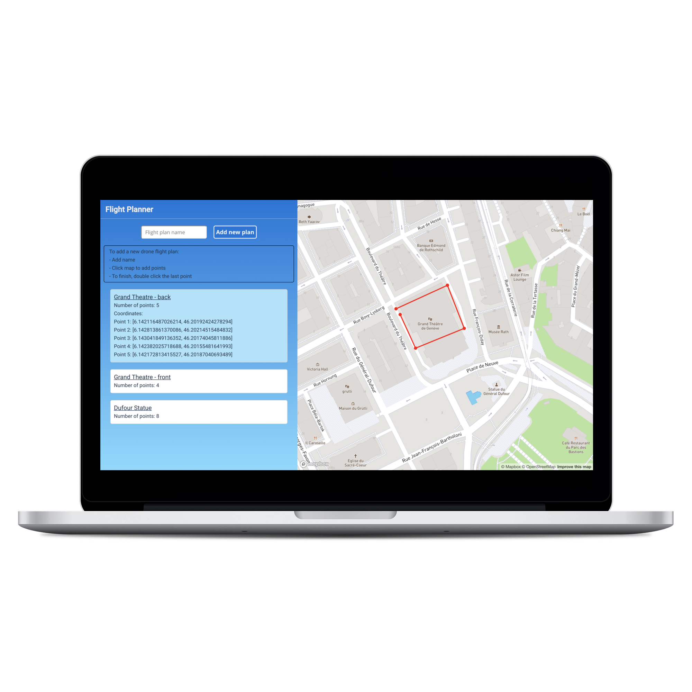

# Drone flight planner

A small prototype for drone flight plans

## Screenshot



## Getting Started
### Prerequisites
- Npm or yarn

### Set up the client
1. **Clone the repo**
```
$ git clone https://github.com/chinins/flight-planner-client.git
$ cd flight-planner-frontend
```
2. **Install dependencies**
```
$ npm install
```
5. **Run it**
```
$ npm start
```
## Tech Stack

### Frontend
- [React](https://reactjs.org/) - frontend framework
- [Mapbox GL](https://www.mapbox.com/mapbox-gl-js/api/) - JavaScript library that uses WebGL to render interactive maps from vector tiles and Mapbox styles

## Author
- Olga Chinina - [Github](https://github.com/chinins)

## Contributing
Contributions Welcome!
This is an on-going project and external input and ideas will be gladly recieved!
## License
This project is licensed under the MIT License, take it, have fun.

